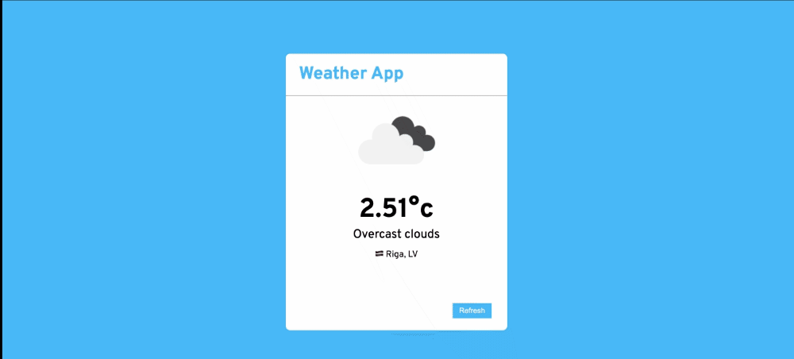

## About The Project

Simple Weather App which retrieves your IP address, Location and Weather Report from public API. 



### Built With

* PHP
* Symfony
* Vue.js
* Docker
* Redis

### Prerequisites

* NPM
* Composer
* Docker 


## Getting Started

### Installation

1. Clone the repo

   ```sh
   git clone https://github.com/ricardslazda/weather-app.git
   ```
2. Install NPM packages

   ```sh
   npm install
   ```
3. Install Composer packages

   ```sh
   composer install
   ```
4. Build front-end assets

   ```sh
   npm run build
5. Configure the API providers in `.env`

   ```sh
   LOCATION_PROVIDER_URL=http://api.ipstack.com
   LOCATION_PROVIDER_ACCESS_KEY={Your_Key}
   
   WEATHER_REPORT_PROVIDER_URL=https://api.openweathermap.org
   WEATHER_REPORT_PROVIDER_ACCESS_KEY={Your_Key}
   ```   
 
6. Start docker-compose

   ```sh
   docker-compose up --build
   ```
   
7. Project should now be available at http://localhost:8080/

   If you encounter issues about undefined properties and refresh doesn't help, it might be because invalid data is cached and it will have to be manually cleaned.
